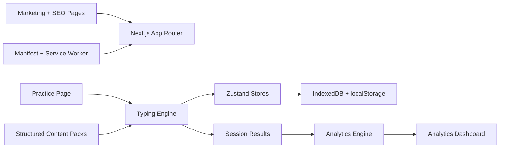

# Typezy


Typezy is a **fast, multilingual, local-first typing practice PWA** built with **Next.js**, **TypeScript**, **Tailwind CSS**, **Zustand**, **Recharts**, and **Framer Motion**.

It is designed to feel calm before typing, invisible during typing, and rewarding after typing.

---

## Live Link 

[Live Link] (https://typezy-five.vercel.app/)

---

### 🔹Typezy Application Demo


---

## What Typezy Is

Typezy is not just a typing test page. It is a typing improvement product that helps users:

- practice instantly without signup
- measure speed and accuracy
- review results immediately
- analyze weak keys, weak words, and trends
- improve through repeated focused sessions

## Core Highlights

- **Zero-signup practice** with a fast first session
- **5 launch languages**: English, Hindi, Spanish, French, German
- **Local-first storage** with `localStorage` and IndexedDB
- **Grapheme-aware scoring** for fair multilingual typing comparison
- **Practice, results, analytics, and settings** flows
- **Export/import** for local session backup
- **PWA support** with manifest, service worker, and offline fallback
- **SEO-friendly App Router setup** with dedicated landing pages
- **Difficulty-aware content system** with structured language packs
- **Dark mode and light mode**

## Tech Stack

- `Next.js`
- `React`
- `TypeScript`
- `Tailwind CSS`
- `Zustand`
- `Recharts`
- `Framer Motion`
- `Vitest`

## Routes

### Marketing and SEO

- `/`
- `/features`
- `/languages`
- `/languages/[lang]`
- `/about`
- `/privacy`
- `/typing-test`
- `/typing-test/[lang]`
- `/english-typing-test`
- `/hindi-typing-test`
- `/free-typing-practice`
- `/improve-typing-speed`

### App

- `/practice`
- `/results`
- `/results/[sessionId]`
- `/analytics`
- `/settings`
- `/offline`
- `/manifest.webmanifest`

## Main Features

### Practice

- time mode
- word target mode
- quote mode
- numbers mode
- punctuation mode
- custom text mode
- code mode
- zen mode
- adaptive mode

### View Modes

- **Text Mode**: minimal chrome, realism, cleaner reading lane
- **Test Mode**: stronger measurement feel and performance framing
- **Practice Mode**: more coaching-oriented guidance

### Analytics

- gross WPM
- net WPM
- accuracy
- consistency
- error count
- backspace count
- pace timeline
- weak keys
- weak words
- session history
- streaks and recommendations

## Project Structure

```txt
app/
  app routes, layouts, metadata, offline and manifest entries
components/
  marketing, practice, analytics, results, providers, layout UI
data/
  structured content packs by language and difficulty
hooks/
  app-specific hooks such as offline/install handling
lib/
  typing engine, analytics, storage, content, utilities, shared types
public/
  icons, service worker, static assets
stores/
  Zustand stores for typing, settings, and stats
tests/
  Vitest coverage for import/export, scoring, content, recommendations, and progress logic
```

## Quick Architecture Diagram



## Content System

Typezy uses a structured content library instead of one flat prompt list.

Content lives under [data/content](C:/Users/vipul/Documents/Codex/2026-04-20-i-put-the-full-blueprint-into/data/content) and is organized by:

- language
- difficulty
- content type

Example structure:

```txt
data/content/
  en/
    beginner.ts
    intermediate.ts
    advanced.ts
  hi/
  es/
  fr/
  de/
```

Each pack can include:

- words
- sentences
- quotes
- punctuation drills
- numbers drills
- code snippets

If you want to expand content manually, keep the same shape and then run test, lint, and build again.

## Getting Started

### 1. Install dependencies

```bash
npm install
```

### 2. Start the dev server

```bash
npm run dev
```

Open:

- [http://localhost:3000](http://localhost:3000)

### 3. Production check

```bash
npm run build
npm run start
```

## Available Scripts

```bash
npm run dev
npm run build
npm run start
npm run lint
npm run test
```

## Local Data Model

### localStorage

Used for:

- theme and visual preferences
- preferred language and mode
- lightweight UI state

### IndexedDB

Used for:

- session history
- analytics data
- aggregates and recommendations

## Security and Hardening

Typezy is local-first, but it still includes production hardening:

- strict import validation
- file-size limits for imported backups
- enum and shape validation for imported sessions
- normalization and clamping before storage
- browser security headers in Next config
- safer service-worker caching rules

Important note:

- Typezy does **not** use accounts, payments, or cloud-stored user profiles in the current version
- user progress stays on-device unless exported manually

## PWA Notes

Typezy includes:

- `manifest.webmanifest`
- production-only service worker registration
- offline fallback page
- shell/static asset caching

When testing locally, if styles or PWA behavior look stale, clear browser site data and unregister the service worker for `localhost`.

## Testing and Verification

Run the full verification set:

```bash
npm run test
npm run lint
npm run build
```

What is currently covered:

- import/export validation
- content library presence
- prompt generation
- pace/attempt calculations
- recommendations
- word progress behavior

## Deployment

Typezy is deployable on modern frontend hosts such as:

- Vercel
- Netlify
- other Node-compatible static/dynamic frontend hosts

Recommended deployment checks:

1. Verify `npm run build` passes locally.
2. Deploy over HTTPS.
3. Confirm `/manifest.webmanifest` is served correctly.
4. Test the service worker and offline fallback on the live domain.
5. Check dark mode and mobile layouts on the deployed site.

## Future Phases

### Phase 1: Strong Launch

- polished homepage and SEO pages
- stable typing engine
- multilingual practice with large content packs
- results and analytics
- local save, export/import, and PWA support

### Phase 2: Deeper Improvement System

- daily challenge
- stronger adaptive drills
- richer coaching after each session
- better streaks and achievement logic
- more device-by-device mobile polish

### Phase 3: Growth and Expansion

- more languages
- larger editorial content libraries
- optional cloud sync
- classroom or team features
- social sharing and progress milestones

## Known Product Focus Areas

Typezy is strongest when these stay true:

- the typing engine feels trustworthy
- the practice surface stays stable and distraction-light
- prompts feel varied and human-readable
- results appear immediately
- analytics help users improve, not just admire numbers

## Documentation

- Product SRS: [TYPEZY_SRS.md](C:/Users/vipul/Documents/Codex/2026-04-20-i-put-the-full-blueprint-into/TYPEZY_SRS.md)
- Installation Guide: [INSTALLATION_GUIDE.md](C:/Users/vipul/Documents/Codex/2026-04-20-i-put-the-full-blueprint-into/INSTALLATION_GUIDE.md)

## Contributing Notes

If you make changes:

1. keep content structured and language-safe
2. avoid weakening prompt stability or progress trust
3. preserve dark-mode and mobile quality
4. run:

```bash
npm run test
npm run lint
npm run build
```

## Product Summary

Typezy aims to combine:

- premium UI
- accurate typing evaluation
- multilingual support
- useful analytics
- local-first privacy
- PWA reliability
- SEO growth architecture

That combination is what makes it more than a basic typing test.
